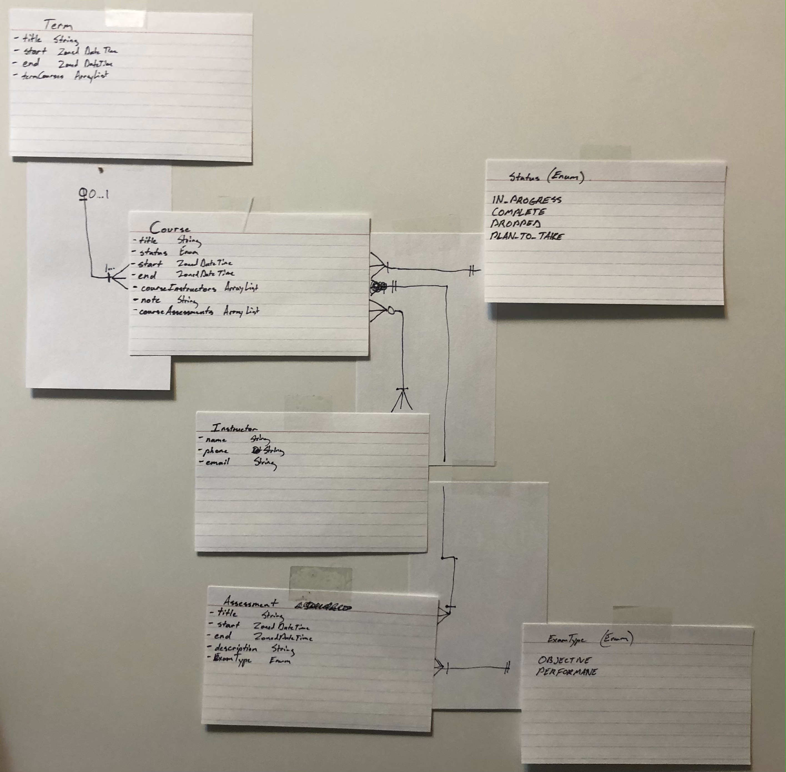
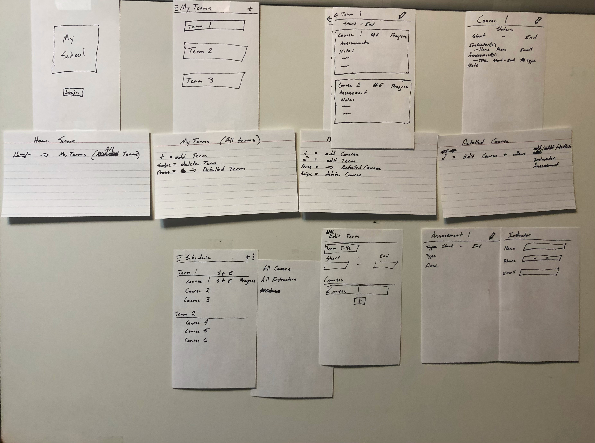

# WGU Mobile Application Development

## Performance Assessment task ABM2 Mobile Application Development

In this course I developed an Android Application using Java meeting specifications as required by [task ABM2](docs/ABM2_TASK_1:MOBILE_APPLICATION_DEVELOPMENT.pdf). Essentially the requirements want you to build an app for a Student to schedule out all their Courses in Terms as if they  are a student at WGU. Meaning you can add as many terms and courses per term, while also having administrator privileges to perform CRUD operations on all entities. Below I briefly talk about how I designed the app starting from the planning.

## Developing the App

### The Plan

After learning as much as I could using the course material and following several tutorials. I started planning how I was going to structure the app. I started with creating the entities and then developing the entity relation diagram on a white board. Later I converted to index cards.

After having the entities, I started to draw out what I wanted the GUI to look like. Then placed them together to form a wireframe.

I knew I did not know enough on how exactly to structure the application and I wanted to try to build relatively modern app using Google's recommendations, so I looked to the Android Studio docs. Finding Android Studios "[Guide to app architecture](https://developer.android.com/jetpack/guide)" was a lifesaver. I used this as my basis and followed it as closely as possible.

### The Build

Building the app I started with the backend using my ERD, which includes the database, entities, DAO's and the repository. Only small entities were used first to test the waters using the guide architecture with viewModels and an activity. Then I started building the frontend with activities  and designing the layouts as per the wireframe.

Once I got an understanding of how it all worked together with activities, I wanted to incorporate fragments since my app was 3 activities at this point: loginScreen, listView, DetailView (the requirement is to have 3). After writing my first fragment, the view when rendered just wrote on top of the activities view. At this point I knew I needed to refactor everything into fragments. Designing around the 3 activities requirement took some thought but I kept it the same.

Skipping ahead, after all the entities were incorporated and everything was functioning as expected I started writing the alarm and share functionality. This didn't take long. The most challenging part of developing the app was realized when I started testing with rotations. The issue was I tied all the ViewModels to the activity in which could have been better if I created parent and child fragments, so instead I created a work around. I talk about this and more of the challenges I faced and overcame in my [reflection document.](docs/MobileDev_C196_Reflection_v3.odt).

### Deployment and Review

After completing the app, I wrote the reflection document, created the [storyboard](docs/MobileDev_C196_Storyboard.pdf), signed the APK, and submitted everything together to WGU. This project taught me a lot, especially on Android lifecycles and how to use Android architecture components to structure my app in the future. The end result is not perfect and the front-end leaves a lot to be desired but it accomplished the task.
